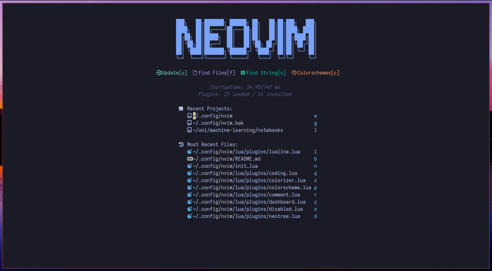
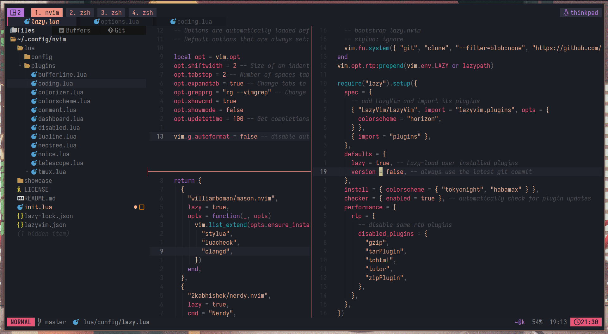
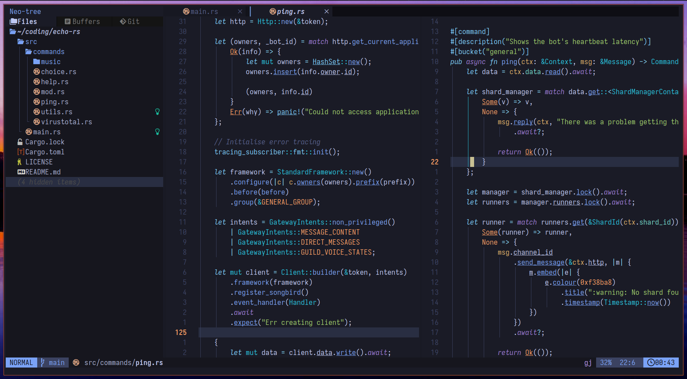
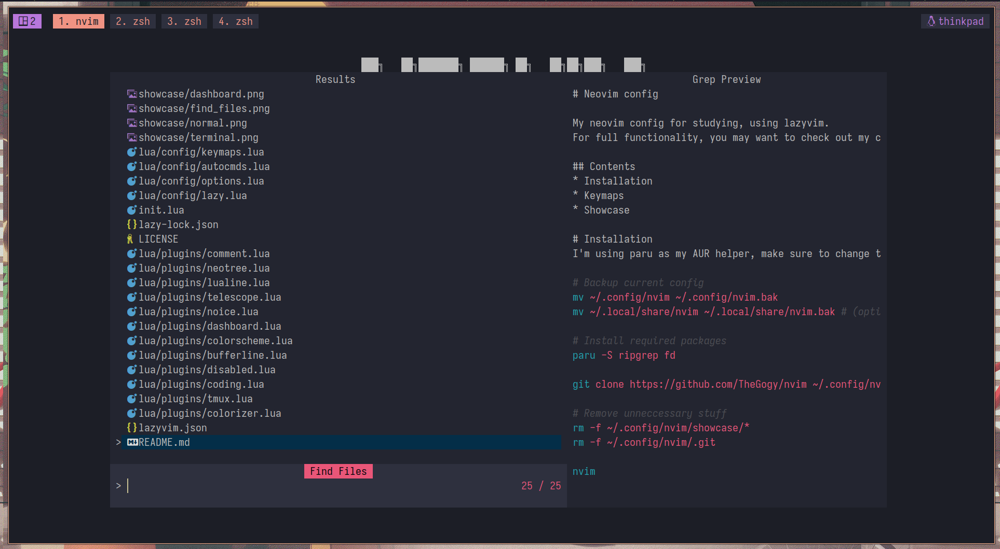
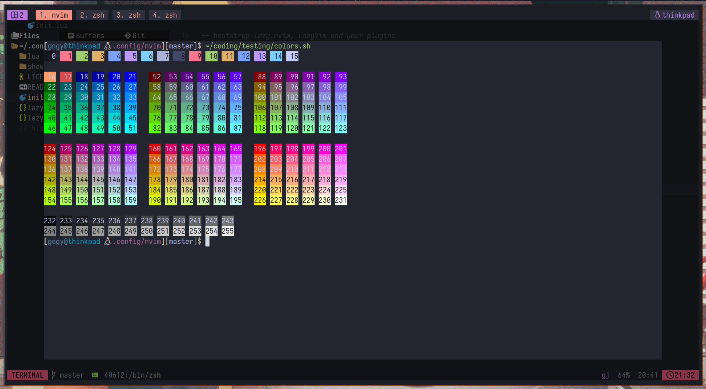

# Neovim config

My neovim config for studying, using [lazyvim](https://lazyvim.org).
For full functionality, you may want to check out my configurations for [tmux](https://github.com/TheGogy/tmux/) and [foot](https://github.com/TheGogy/dotfiles/blob/main/foot/foot.ini).

## Contents
* [Installation](#installation)
* [Keymaps](#Keymaps)
* [Showcase](#Showcase)

# Installation 
I'm using [paru](https://github.com/morganmilo/paru) as my AUR helper, make sure to change that to your package manager if required.
```bash
# Backup current config
mv ~/.config/nvim ~/.config/nvim.bak
mv ~/.local/share/nvim ~/.local/share/nvim.bak

# Install required packages
paru -S ripgrep fd

git clone https://github.com/TheGogy/nvim ~/.config/nvim

# Remove unneccessary stuff
rm -rf ~/.config/nvim/showcase
rm -rf ~/.config/nvim/.git

nvim
```

# Keymaps

Most keymaps have already been set by lazyvim. For a list of these presets, see [here](https://www.lazyvim.org/keymaps).

| Keymap        | Command                                    |
| ------------- | ------------------------------------------ |
| `alt` + `.`   | Switch to right buffer (same for neo-tree) |
| `alt` + `,`   | Switch to left buffer (same for neo-tree)  |
| `alt` + `<`   | Switch current buffer with left buffer     |
| `alt` + `>`   | Switch current buffer with right buffer    |
| `alt` + `<n>` | Switch to buffer `<n>`                     |
| `alt` + `p`   | Toggle pin for active buffer               |
| `alt` + `w`   | Close active buffer                        |
| `alt` + `W`   | Close all buffers except active buffer     |
| `<leader>/`   | Toggle comment                             |
| `<leader>fw`  | Telescope live_grep                        |
| `<leader>ff`  | Telescope find_files                       |
| `<leader>ci`  | Find Nerd Fonts icon                       |


> [!NOTE]
> This setup is using a workaround for `alt` + `< >`, to ensure compatibility for foot terminal. If this is causing problem for your terminal, see [`keymaps.lua`](./lua/config/keymaps.lua).

# Showcase






The script to print colours in the terminal can be found [here](https://gist.github.com/HaleTom/89ffe32783f89f403bba96bd7bcd1263).
